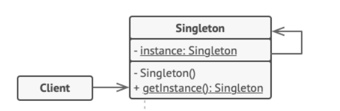
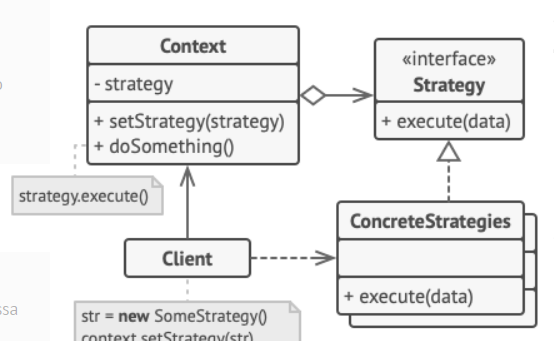
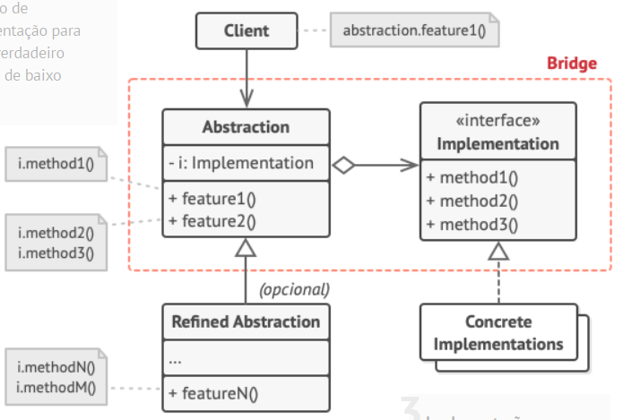

# padroes-de-projeto

# - Singleton

Singleton: O padrão de projeto Singleton é utilizado para garantir que uma classe tenha apenas uma única instância e fornece um ponto global de acesso a ela. O padrão Singleton resolve vários problemas relacionados à criação e gerenciamento de instâncias de classes em sistemas de software.

SingletonMeta:

É uma metaclasse que gerencia a criação das instâncias.
O método __call__ é sobrescrito para controlar a criação de objetos. Ele verifica se uma instância da classe já existe; se não existir, cria e armazena no dicionário _instances.

Classe Singleton:
Qualquer classe que use SingletonMeta como metaclasse automaticamente implementará o padrão Singleton.

## - UML

# - Strategy

Strategy é um padrão de comportamento que permite definir uma família de algoritmos, encapsulá-los e torná-los intercambiáveis, permitindo que o algoritmo varie independentemente do cliente que o utiliza. O padrão Strategy utiliza uma interface genérica que expõe apenas um único método, permitindo ao contexto acionar o algoritmo encapsulado na estratégia escolhida. Isso garante que o contexto permaneça independente das implementações específicas das estratégias.
Dessa forma, é possível adicionar novos algoritmos ou modificar os já existentes sem alterar o código do contexto ou das outras estratégias, mantendo a flexibilidade e a extensibilidade do sistema.

DiscountStrategy: Define a estrutura para todas as estratégias de desconto.
Estratégias concretas (NoDiscount, PercentageDiscount, FixedDiscount): Implementam diferentes maneiras de calcular o desconto.
Order: Usa uma estratégia de desconto específica, sem precisar conhecer os detalhes de sua implementação.

## - UML

# - Bridge

Bridge: O padrão de projeto Bridge é utilizado para "desacoplar uma abstração de sua implementação para que as duas possam variar independentemente". Ele é muito útil para evitar a explosão de subclasses que pode ocorrer ao tentar combinar várias dimensões de variação.
O padrão de projeto Bridge resolve uma série de problemas relacionados à complexidade, rigidez e falta de flexibilidade na estrutura de classes, especialmente quando diferentes dimensões de variação precisam ser gerenciadas.

Device: Representam as diferentes implementações concretas, como TV e Radio.
RemoteControl: Define a interface para interagir com os dispositivos.
AdvancedRemoteControl: Adiciona funcionalidades extras ao controle básico, como a função "mute".
Bridge: A conexão entre o controle e o dispositivo é estabelecida por composição. O controle usa um dispositivo (Device) sem saber exatamente qual é sua implementação. 
Isso permite que a abstração (controle) e a implementação (dispositivo) evoluam separadamente.

## - UML

Reference: https://refactoring.guru